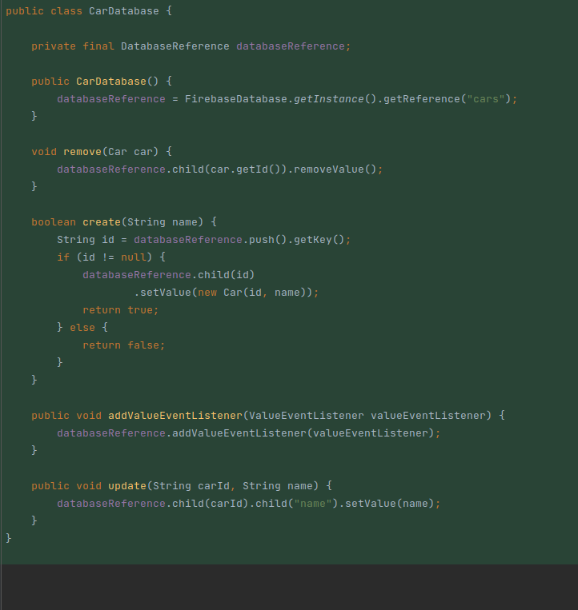
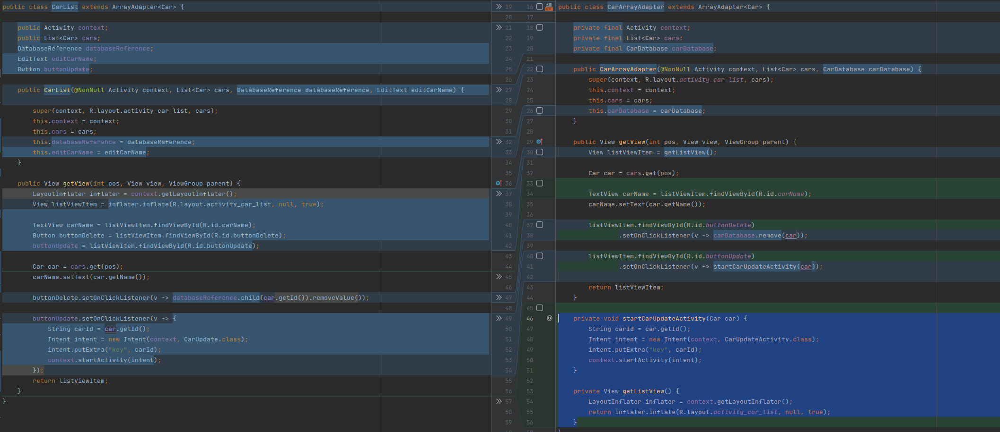
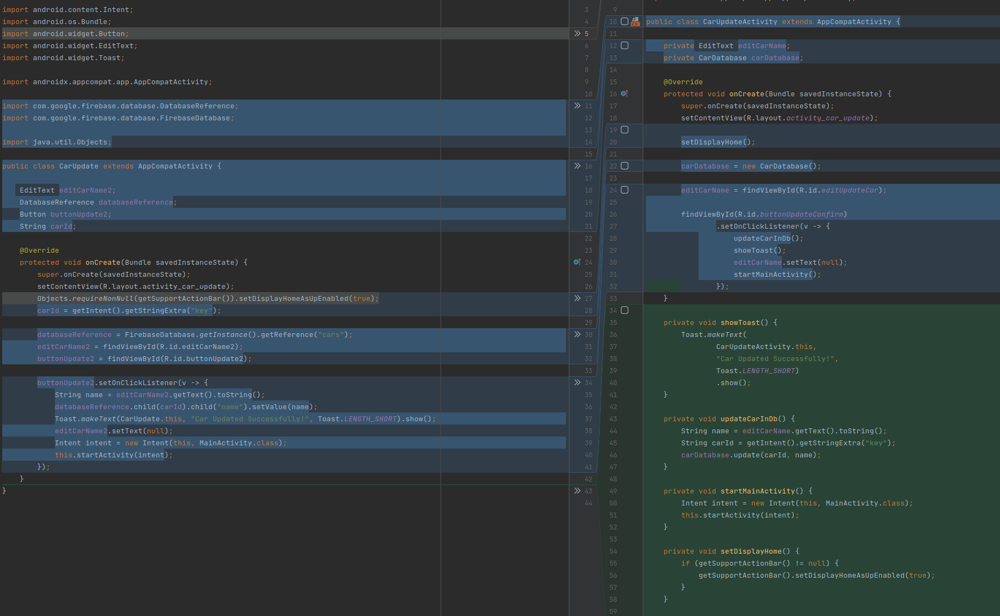
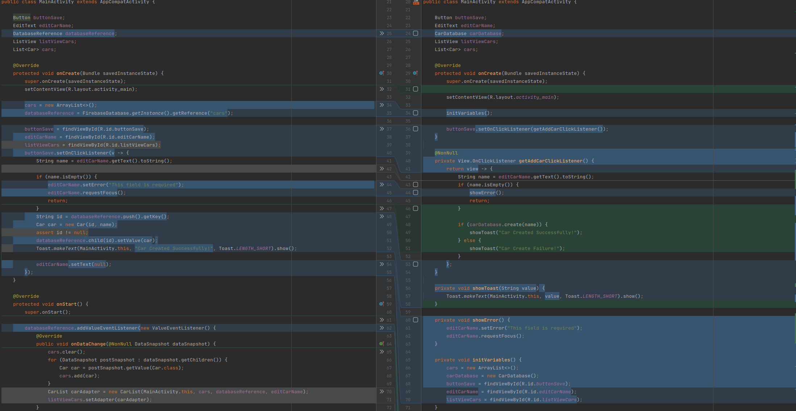
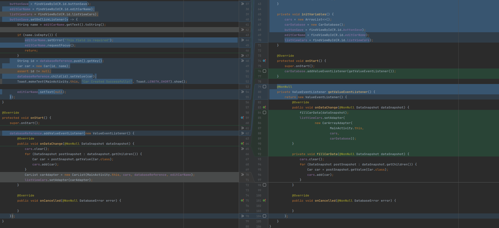

# CarCrud
W celu wykonania clean up code, skorzystałem z funkcji reformat code, która znajduje się na górnym pasku w Android studio (Code->Reformat code). Pozwala to usunąć niepotrzebne 
importy i wyrównać kod.
Można też użyć skrótu klawiszowego Ctrl+Alt+L. Zamieniłem nazwy zmiennych w taki sposób, aby odzwierciedlały po nazwie ich zastosowanie. 
Wyrównałem linie w kodzie. W tym celu skorzystałem z Preferences w settings. Znajdują się tam parametry, które pozwalają określić jak ułożony ma być kod.
Usunąłem wszystkie komentarze.
W przypadku podkreślenia zmiennych falowaną linią koloru zielonego pojawiał się warning. Wystąpiły dwa takie przypadki. Dlatego też skorzystałem z funkcji dodania nazw tych zmiennych 
do słownika.
Wszędzie gdzie było to możliwe usunąłem podświetlenia na żółto. Z wyjątkiem jednego podświetlenia. Nie usuwałem go zgodnie z Pana wskazówkami.
Wszystkie przypadki w których wystąpił kolor szary usunąłęm. Jest jeden wyjątek. W klasie Car przy tworzeniu kontruktora. Po jego usunięciu aplikacja nie działa prawidłowo
(pojawia się komunikat close App).
W przypadku np. buttonUpdate nie mogłem użyć tych samych zmiennych zarówno w klasie Carupdate, jak i CarList, ponieważ podczas aplikacja nie działała poprawnie. Dlatego zastosowałem
nazwę zmiennej buttonUpdate2. Cyfra 2 oznacza drugą aktywność (CarUpdate) do, której przenosi się użytkownik z MainActivity.
Nazwę aktywności layout_car_list zamieniłem na activity_car_list, żeby wszystkie miały taką samą nazwę.

# CarDatabase

Wydzieliłem nową klase, która objemuje funkcjonalności dotyczące operacji na bazie danych.

# CarArrayAdapter

1. Zmieniłem nazwe klasy, tak aby informowała o swojej funkcjonalności.
2. W celu zwiększenia czytelności kodu wydwydzieliłem dwie metody "startCarUpdateActivity" i "getListView".
3. Usunąłem wszystkie zmienne wykorzystywane tylko raz w kodzie.

# CarUpdateActivity

1. Dodałem do nazwy klasy "Activity", klasa teraz lepiej informuje o swojej odpowiedzialości
2. Aby skrócić zapis metody "onCreate" i zwiększyć jej czytelność, wydzieliłem 4 metody.
3. Usunąłem ze zmiennych numeracje w nazwie.

# MainActivity

1. Również w tej klasie postarałem wydzielić sie metody tak aby kod był bardziej czytelny.
2. Metoda "showToast" służy do wyświetlania toast-u ponieważ w kodzie w jej wywołaniu zmienia sie tylko jeden argument wydzialając ją, zwiększyłem czytelność, umożliwiając jednocześnie jej ponowne wykorzystanie 

